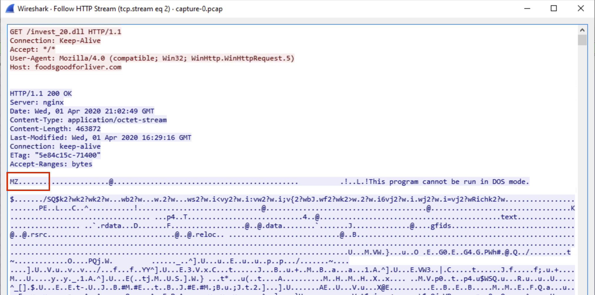
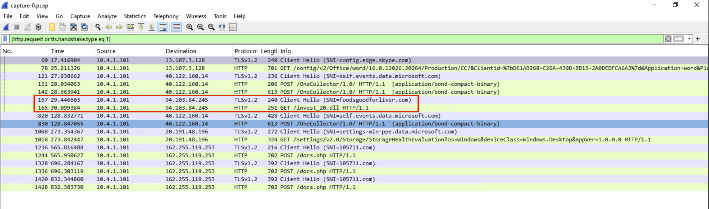
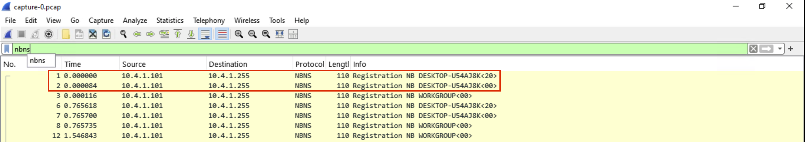
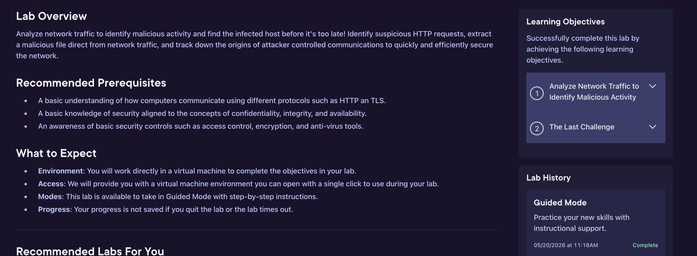

# 🛡️ Pluralsight Hands-On Lab — Hands-On Project

> Hands-on cybersecurity lab from Pluralsight with implementation notes and outcomes.


---

## 📌 Overview

This repository documents my hands-on completion of **Pluralsight Hands-On Lab — Hands-On Project** on **Pluralsight**.
It includes the methodology I followed, tools I used, evidence I captured, and the skills I demonstrated.

**Lab URL:** https://app.pluralsight.com/hands-on/labs/09462adf-0dc2-4eac-94ba-11949025122c?originUrl=https%3A%2F%2Fapp.pluralsight.com%2Fhands-on

---

## 🎯 Objectives

- Complete the guided hands-on lab from start to finish
- Demonstrate practical application of the security concepts taught
- Configure and validate the security control or detection
- Document the process for future reference and portfolio

---

## 🧰 Tools & Technologies

`Pluralsight Hands-On Sandbox` · `Cloud console (Azure / AWS / GCP)` · `PowerShell / Bash` · `Browser developer tools`

---

## 🧠 Security Concepts Demonstrated

- Cloud security configuration
- Identity & access management
- Logging and monitoring
- Detection engineering

---

## 🏗️ Architecture / Lab Environment

> See `diagrams/architecture.md` for a description of the lab setup.
> Add a diagram image at `diagrams/architecture.png` (you can draw one in [draw.io](https://app.diagrams.net/) or [Excalidraw](https://excalidraw.com/) for free).


---

## 🪜 Walkthrough

> Replace this section with your actual step-by-step walkthrough.
> Use the placeholders below as a starting structure.

### Step 1 — Setup & Recon
Describe how you set up the environment and what initial reconnaissance you performed.

### Step 2 — Investigation / Exploitation
Describe the main work of the lab — the queries you ran, exploits you tried, or controls you configured.

### Step 3 — Validation
Describe how you confirmed the work was correct (alerts fired, exploit succeeded, control blocked the attack, etc).

### Step 4 — Cleanup & Reflection
Describe how you ended the lab and what you'd do differently next time.

### 📝 My Lab Notes

> The following are my raw notes captured during the lab.

```
Used Wireshark to find IoC. Filtered for TLS handshakes. Extracted the malicious file for analysis in the sandbox. Discovered malware attempting to call out to the C2 server. Identified the compromised endpoint to quarantine.
```

---

## 📸 Screenshots

> Drop matching PNG/JPG files into the `screenshots/` folder using the filenames below.

### Lab Environment

> Lab environment overview



### Configuration

> Key configuration step



### Validation

> Validating the control works



### Completion

> Lab completion screen



---

## 🎯 MITRE ATT&CK Mapping

| ID | Tactic / Technique | How it appears in this lab |
|----|--------------------|----------------------------|
| `TA0006` | Credential Access | Common credential attack patterns covered in lab |
| `TA0007` | Discovery | Resource enumeration techniques |
| `TA0005` | Defense Evasion | Concepts around detecting evasion attempts |

---

## 🧠 What I Learned

- Bridging theory to practice in a sandboxed environment
- How production-style configurations differ from documentation examples
- Why structured note-taking accelerates the learning curve

---

## 🚨 Common Mistakes I Avoided (or Made)

- _Add 2–3 mistakes you ran into and how you solved them. Recruiters love this section — it shows reflection._

---

## 🛠️ Skills Gained

- Pluralsight Hands-On Sandbox
- Cloud console (Azure / AWS / GCP)
- PowerShell / Bash
- Browser developer tools
- Cloud security configuration
- Identity & access management
- Logging and monitoring

---

## 📚 Suggested Next Projects

- Replicate the lab in your own free-tier cloud account
- Add monitoring/alerting on top of the lab outcome
- Take a related Pluralsight skill assessment
- Build a more complex lab combining these skills

---

## 💼 Resume Bullets

> Copy/paste these straight into your resume:

- Completed Pluralsight hands-on cybersecurity lab: Pluralsight Hands-On Lab
- Applied lab concepts in a real cloud environment with documented outcomes
- Built portfolio writeup with screenshots, configuration notes, and lessons learned

---

## 🔗 References

- [Pluralsight](https://app.pluralsight.com/hands-on/labs/09462adf-0dc2-4eac-94ba-11949025122c?originUrl=https%3A%2F%2Fapp.pluralsight.com%2Fhands-on)
- [MITRE ATT&CK Framework](https://attack.mitre.org/)
- [GitHub Markdown Guide](https://docs.github.com/en/get-started/writing-on-github)

---

## 👤 About Me

I'm **Jonathan Luzader**, a cybersecurity student building public proof-of-skill through hands-on labs and detailed writeups.

- 🌐 GitHub: [@darthloozader](https://github.com/darthloozader)
- 📂 More projects: see my [pinned repositories](https://github.com/darthloozader)

---

## 📝 License

MIT — see [LICENSE](LICENSE).

---

> 🛠️ Generated with [Portfolio Forge](https://github.com/) — a free PWA that turns lab URLs into GitHub portfolio repos.
