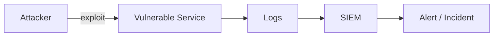

# 🏗️ Architecture

> Describe the components and data flow of your lab environment here.
> Then create a diagram (see "How to draw the diagram" below) and save it as `architecture.png` in this folder.

---

## Components

- _List each major component (VMs, services, log sources, etc.)_

## Data flow

1. _Step 1 of how data moves through the lab_
2. _Step 2_
3. _Step 3_

## Security controls demonstrated

- _Control 1: what it does, why it matters_
- _Control 2: ..._

---

## 🎨 How to draw the diagram (free, no signup)

**Option 1 — [Excalidraw](https://excalidraw.com/)** (hand-drawn feel, great for portfolios)
1. Open excalidraw.com
2. Drag rectangles, arrows, labels for each component
3. Click **Export image** → save as `architecture.png` in this folder

**Option 2 — [draw.io](https://app.diagrams.net/)** (more polished, professional look)
1. Open app.diagrams.net
2. Use the AWS / Azure / GCP shape library for cloud icons
3. **File → Export as → PNG** into this folder

**Option 3 — Mermaid (text-based, lives right in markdown)**

